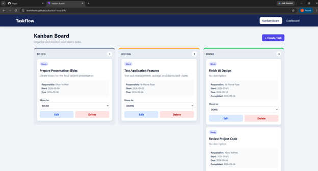

# TaskFlow – Kanban Board with Dashboard

TaskFlow is a React web application that helps users create, organize, and monitor team tasks. Tasks are arranged in three columns: TO DO, DOING, and DONE. The Dashboard summarizes task information using cards and charts.

## Live Website

[Open TaskFlow](https://avanshorty.github.io/kanban-board/)

## Project Features

- Create new tasks
- Edit existing tasks
- Delete tasks with a confirmation message
- Move tasks between TO DO, DOING, and DONE
- Assign a responsible person to each task
- Select an existing category
- Add new categories
- Set start dates and due dates
- Automatically record the completion date
- Identify overdue tasks
- Display task summary cards
- Display tasks by status in a doughnut chart
- Display tasks by category in a bar chart
- Compare early, on-time, and late task completion
- Save tasks and categories in Local Storage

## Technologies Used

- React JS
- Vite
- React Router
- Chart.js
- CSS
- Local Storage

## Basic Usage

1. Open the live website.
2. Click **Create Task** to add a task.
3. Enter the task information and select a responsible person.
4. Select an existing category or add a new category.
5. Use the **Move to** dropdown to move tasks between columns.
6. Click **Edit** to update a task.
7. Click **Delete** to remove a task.
8. Open the **Dashboard** page to view task summaries and charts.
9. Refresh the page to confirm that the information remains saved.

## Screenshots

### Kanban Board

### Dashboard

## Group Members

- Ye Phone Pyae
- Khun Ye Htet
- Aunt Htoo Lin Win
